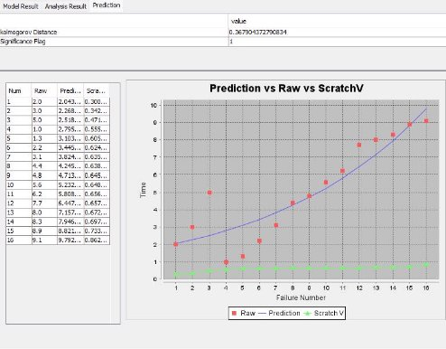

**SENG 438- Software Testing, Reliability, and Quality**

**Lab. Report \#5 – Software Reliability Assessment**

| Group \#:       |21|
|-----------------|---|
| Student Names:  |   |
|Mason Bullock|30139550|
|Nathan Romphf|30112397|
|Sanika Shendye	|30114344|
|Samir Sakr	|30142256|

# Introduction
The goal of this assignment was to use reliability assessment tools such as SRTAT(the one we used), C-SFRAT , and a reliability demonstration chart (RDC) within Excel, to assess the accuracy and predictability of failure reports. We will use reliability growth testing software to measure failure rate and mean time between failures (or MTTF for short), familiarizing ourselves with the usage of such tools. We will then use an RDC to determine the accuracy of the computed MTTF of the SUT.
# 

# Assessment Using Reliability Growth Testing 
Using SRTAT, we found that the two models which best represented Failure Report 8’s data were Geometric as well as Littlewood and Varral’s Bayesian Reliability. The failure data we used was the time between failures found in failure report 8. These two models plots are attached below:

**Geometric:**

**Littlewood and Varral’s Bayesian Reliability:**

As you can visually see, the raw points are quite close to each of the model's predicted curves. This is further shown by the Kolmogorov distances being quite similar to each other, geometric being 0.36 while Littlewood and Varral’s Bayesian Reliability is 0.38. These scores indicate that the predicted values are quite similar to the actual data points, proving that these models are worthwhile.

**Interquartile range method for determining outliers**
|Data Point|Time between failures|
| - | - |
|1|2\.0|
|2|3\.0|
|3|5\.0|
|4|1\.0|
|5|1\.3|
|6|2\.2|
|7|3\.1|
|8|4\.4|
|9|4\.8|
|10|5\.6|
|11|6\.2|
|12|7\.7|
|13|8\.0|
|14|8\.3|
|15|8\.9|
|16|9\.1|

Sorting the data for time between failures we have:

1, 1.3, 2.2, 3, 3.1, 4.4, 4.8, 5, 5.6, 6.2, 7.7, 8, 8.3, 8.9, 9.1

Q1 = 3, Q2 = 5, Q3 = 8

IQR = 8 - 3 = 5

Upper limit for data = 8 + 1.5(5) = 15.5

Lower limit for data = 3 - 1.5(5) = -4.5 = 0 (time between failures cannot be negative)

When it came to deciding on which part of the data was good to use during our analysis, we resorted to finding any outliers within our dataset. However, there were no significant outliers found within our dataset so the whole dataset can be used in our future analysis.

**A discussion on decision making given a target failure rate**

When deciding on a target failure rate, it's essentially about setting a threshold for how often something can go wrong before it becomes a big problem. This decision has significant implications because it determines where resources are allocated and how much risk a company is willing to take. Striking the right balance here is crucial for ensuring that resources are used effectively and that the company's overall goals are met. In our situation, keeping in mind that MTTF = operating time / total failures, we get MTTF = 16 failures / 79.6 hours = 0.201. This means that every hour we experience 0.201 failure, so flipping it around we get that every 4.975 hours, we experience one failure. This lines up well with what we found in our previous plots.

**A discussion on the advantages and disadvantages of reliability growth analysis**

Reliability growth analysis is a method used to improve the reliability of systems over time by identifying and addressing weaknesses. It's advantageous because it helps prevent failures, which can save money in the long run. However, it's a complex process that requires a lot of resources, and it may not catch every potential problem. Still, if implemented properly, reliability growth analysis can lead to better products and happier customers by making sure things work more reliably.

# Assessment Using Reliability Demonstration Chart 

Minimum MTTF:

Max Number of failures per 50 hours is 12 failures λ = 12 failures / 50 hours  = 0. 24  failures/ℎ

MTTFmin = 50 / 12 = 4.167 hours

We selected the MTTFmin to be at the failure level where the data points start in the “Continue test” section on the graph and trends into the “Accept” region as further data is collected, without ever entering the “Reject” region. We used trial and error to experiment with values until we found an optimal MTTF that met the requirements laid out.

Twice the Minimum MTTF
2MTTFmin = 2(50/8) = 8.333 hours 

failure rate = 6 failures / 50 hours = 0.12 failures/hour

Half of the Minimum MTTF:

(1/2)MTTF = (0.5)(50/12) = 2.083 hours

failure rate = 24 failures / 50 hours = 0.48 failures/hour

**Advantages and Disadvantages of RDC:**

RDC analysis is a very versatile tool that is time efficient as it only requires you to input data points for failure data, and cost efficient as it is a free to use excel spreadsheet. It also very quickly can show you how different parameters may affect the system, such as what if analysis on different minimum mean time till failures, or different levels of risk acceptance when determining the bounds for reject, continue, and accept.

One major downside to the RDC tool is that it does not give exact insights into the reliability of the system in terms of numeric data, but rather visually displays the acceptability of the system, and its failure data based on parameters, and system requirements.
# 

# Comparison of Results

In part one of the lab the data shows that the initial data point gave us a MTTF of approximately 2.2 hours and then the data trended upwards with an exponential curve meaning that each subsequent failure had a longer time between it and the previous failure This is concurrent with what was seen in the RDC testing as the first data point appeared at approximately 2.2 and all data after that trended upwards and to the right meaning subsequent failures occurred further apart.

# Discussion on Similarity and Differences of the Two Techniques

Similarities:

- Both the RDC and RGT work to improve the reliability and overall quality of the software being developed
- Both techniques require a range of input failure data to be provided to reasonably determine the acceptability/reliability of the software being tested.

Differences:

- RGT is used to improve the reliability of a product or system over time through failure analysis whereas RDC takes a snapshot of the failure data to examine it against a set of predefined reliability requirements.
- RGT can inform developers of areas of the software that require more testing efforts, whereas RDC evaluates the effectiveness of the testing approaches after they have been carried out.

# How the team work/effort was divided and managed

Work was equally divided between two peer programming groups. In each of these two groups, one student was the driver who would actively code while the other was the passenger, who would watch and advise the driver. After a while the driver and passenger would switch spots in order to keep workloads somewhat equal. This helped us work efficiently together while avoiding the “too many cooks in the kitchen” scenario.

# 

# Difficulties encountered, challenges overcome, and lessons learned

Some difficulties we encountered were getting the SRTAT tool up and running. This task took quite a while as there was not much documentation or explanation on the proper way to run it. For example, when trying to upload a file to the .jar file, the error message “unsuuported file type” was very broad and did not help us at all. This error did not only pop up if the file type was unsupported, but it would also pop up if inside the file the data was formatted a tiny bit off. This was quite frustrating. However, we learned how to overcome this challenge and were able to complete the lab. For next time, we learned to be more meticulous with our work to avoid such things in the future.

# Comments/feedback on the lab itself

The lab instructions were very confusing and broad, this lead to uncertainty and doubt on where/how to move next. The most time consuming bit of this lab was trying to understand the file format that the SRTAT jar file was requesting and how to convert it to that format.
